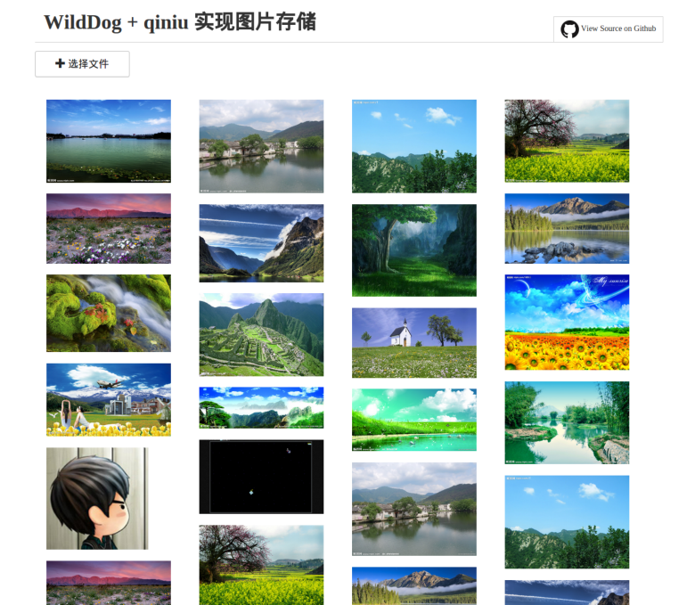

demo-js-wildqiniu
============

基于野狗和七牛API及Plupload开发的简单图片上传demo

## 概述

本SDK适用于IE8+、Chrome、Firefox、Safari 等浏览器，基于野狗和七牛云存储官方API 构建，其中上传功能基于 Plupload 插件封装。开发者使用本 SDK 可以方便的从浏览器端上传文件至七牛云存储，
并对上传成功后的图片的url等基础信息存入野狗实时数据库。



### 构成介绍

	├── demo　　　　
	│   ├── js
	│   │   ├── conf.js	demo野狗数据库引用url配置
	│   │   ├── main.js 	主函数入口，主要实现图片上传和图片地址存入野狗数据库
	│   │   ├── masonry-docs.min.js 实现demo瀑布流
	│   │   ├── plupload  建议 2.1.1 及以上版本
	│   │   ├── qiniu.js  SDK主体文件，上传功能\数据处理实现
	│   ├── server.js　　　　　后端server文件
	│   ├── config.js　　　　　七牛配置文件
	│   └── views
	│       └── index.html　　　　　　　　　　　　　　　　　　　　　　　　　　　　　　　　
	├── Gruntfile.coffee
	├── Makefile	      make配置文件
	├── package.json　　　　　　npm install
	├── README.md
	└── src
	    ├── qiniu.js
	    ├── qiniu.min.js   　七牛sdk
	    └── wilddog.js  	野狗javascript sdk


## 运行示例

直接运行本SDK示例网站的服务

*  安装 [Nodejs](http://nodejs.org/download/)、[npm](https://www.npmjs.org/)

*  获取源代码：
    `git clone https://github.com/WildDogTeam/demo-js-wildqiniu.git`
*  进入`demo`目录,修改`config.js`，`Access Key`和`Secret Key` 按如下方式获取

    * [开通七牛开发者帐号](https://portal.qiniu.com/signup)
    * [登录七牛开发者自助平台，查看 AccessKey 和 SecretKey](https://portal.qiniu.com/setting/key) 。

        ```javascript

            module.exports = {
			'ACCESS_KEY': 'uYloQGwKRDQ0Oi9QA21H3u-V8AR0Gx6HBwCxJmiJ',
			'SECRET_KEY': '2CckSyuEpevMLAzFsWswlCmYyWgb3kM6nSVUd3jP',
			'Bucket_Name': 'baidu',
			'Port': 18080,
			'Uptoken_Url': '/uptoken',
			'Domain': 'http://qiniu-plupload.qiniudn.com/'
            }

        ```

    * [野狗开发者帐号](https://www.wilddog.com/my-account/signup)

        ```javascript

            'wilddog':{
                'baseurl':'<https://<yourappId>.wilddogio.com/' ////野狗url引用地址      
            },
            'qiniu':{
                 'imageBaseUrl':'<http://7xklh8.com1.z0.glb.clouddn.com/>' //七牛存储图片的baseurl,本例demo中用到，代码七牛图片存储的url前缀 
            }

        ```
    * 主要代码，主要是图片上传成功后，在回调函数中保存数据到野狗数据库

        ```javscript

		'FileUploaded': {
			var res = $.parseJSON(info);
			var url;
			if (res.url) {
				url = res.url;
			} else {
				var domain = up.getOption('domain');
				url = domain + encodeURI(res.key);
				var link = domain + res.key;
			}
			var ref = new  Wilddog(conf.wilddog.baseurl);//图片上传成功后，存储回调信息(name ,url等)，实际开发中可以自己定义json格式
                        ref.push({
                        "id":randomString(10),
                        "name" : res.key,
                        "url":url,
                        "time": new Date().getTime()
                    });
		}
		```

*  在根目录运行`make`启动

*  访问`http://127.0.0.1:18080/`或`http://localhost:18080/`


## 相关文档

* [Wilddog 概览](https://z.wilddog.com/overview/guide)
* [JavaScript SDK快速入门](https://z.wilddog.com/web/quickstart)
* [JavaScript SDK 开发向导](https://z.wilddog.com/web/guide/1)
* [JavaScript SDK API](https://z.wilddog.com/web/api)
* [下载页面](https://www.wilddog.com/download/)
* [Wilddog FAQ](https://z.wilddog.com/faq/qa)
* [七牛官方文档-上传](http://developer.qiniu.com/docs/v6/api/reference/up/)
* [七牛官方文档-图片处理](http://developer.qiniu.com/docs/v6/api/reference/fop/image/)

## License
MIT
http://wilddog.mit-license.org/

## 感谢 Thanks

We would like to thank the following projects for helping us achieve our goals:

Open Source:

* [qiniu](https://github.com/qiniu/js-sdk) 七牛sdk
